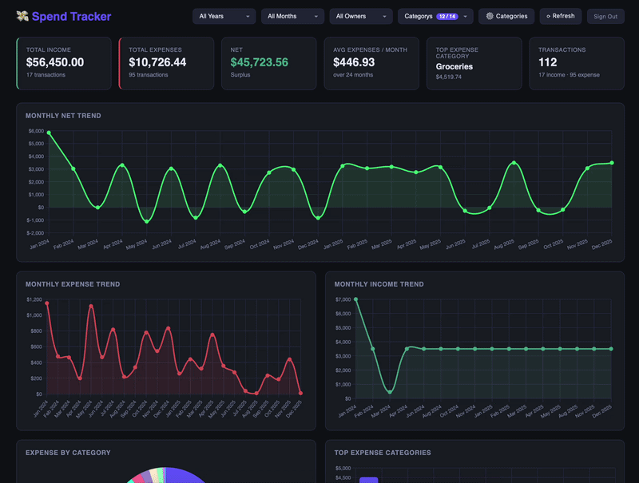

Check out the "Demo Mode" wih any public google sheet: https://xwenps.github.io/spend-tracker/


## About

Spend Tracker is an app that links to a Google Sheet. 
No direct connections to financial institutions needed.
Categorize your transactions and adjust with ease and all the flexibility Google Sheets offers.

## Config

If hosting locally, you can store the Google Client ID and Sheet ID for autofilling within a `config.json`

```
{
  "clientId": "<SOMETHING>.apps.googleusercontent.com",
  "sheetId":  "<SHEET ID>",
  "years":    ["2023", "2024", "2025", "2026"]
}
```
## Pre-Reqs

### Source Data
Assumption is source data is hosted on Google Sheets. You will need the `SHEET ID` from your source data's URL: `https://docs.google.com/spreadsheets/d/{SHEET_ID}/gviz/tq?tqx=out:csv&sheet={SHEET_NAME}`

The source data has the following required columns
```
date: date transaction was posted
amount: amount of the transaction (signed)
category: category assigned to the transaction
```

### Google Credentials
This app currently pulls directly from Google Sheets using OAuth2 scopes. 
You must enable API access to Google Sheets, create an OAuth2 Client ID and set restrictions to allow from the proper website URIs.

#### Step 1: Create a Google Cloud Project
1. Go to console.cloud.google.com
2. Click the project dropdown at the top → New Project
3. Name it anything (e.g., "Spend Tracker") and click Create
4. Make sure the new project is selected in the dropdown
​
#### Step 2: Enable the Google Sheets API
1. In the left menu, go to APIs & Services → Library
2. Search for "Google Sheets API"
3. Click it and hit Enable

#### Step 3: Create the OAuth2 client ID
1. In APIs & Services → Credentials, also create an OAuth 2.0 Client ID (type: Web application)
2. Add `http://localhost` (or alternative hosted origin ie. ` https://xwenps.github.io`) to Authorized JavaScript origins
3. You'll use the `Client ID` to connect
4. You should get the Data Access to allow only for Reads to Spreadsheets: `.../auth/spreadsheets.readonly`

## How to Run

### Github Hosted Page

Access directly hosted on: https://xwenps.github.io/spend-analyzer/

> **Note:** This is a static webpage. All code is run locally
> on your browser and no interaction is made with any backend
> server besides your reads from your google sheet.


### Local Run
```
cd <your-folder>
python3 -m http.server 8080
```

Open http://localhost:8080 in your browser

### Data Processor

Data processor takes CSV exports from various financial institutes and transforms the raw data into the standard schema expected by the Spend Analyzer. This data processor currently supports the following banks and cards:

| Institution      | Account Type              | CSV Format Notes                                                                             |
| ---------------- | ------------------------- | -------------------------------------------------------------------------------------------- |
| Capital One      | Credit Card               |                                 |
| Chase            | Bank / Checking Account   |                                          |
| Chase            | Credit Card               |  |
| American Express | Credit Card               |  |
| Citi             | CustomCash Card           |                                                                          |
| Citi             | Costco Anywhere Visa Card | Costco Partner card has different format than standard Citi cards                                   |

#### Bank Auto-Detection Fingerprints

Auto-detection reads only the CSV header row and matches against unique column
combinations. Order matters — more specific rules are evaluated first.

| Priority | Bank | Unique Signal | Rationale |
|---|---|---|---|
| 1 | Capital One (Credit Card) | `posted date` + `card no.` | No other supported bank exports a `card no.` column |
| 2 | Chase (Bank Account) | `posting date` + `balance` | Only the checking account export includes a running `balance` column |
| 3 | Chase (Credit Card) | `post date` + `memo` | Credit card export adds a `memo` field absent from the bank account export |
| 4 | Citi (Costco Anywhere) | `member name` | Completely unique to Costco Anywhere's member tracking; checked before CustomCash to avoid subset collision |
| 5 | Citi (CustomCash) | `status` + `debit` + `credit` | Combination of all three narrows to Citi after Costco Anywhere is already ruled out |
| 6 | American Express | `date` + `amount` + no `debit`/`balance` + ≤ 5 columns | Amex exports only 3 columns — the sparsest format of all supported banks |

> **Note:** If a new bank shares common column names (`date`, `amount`,
> `description`) with an existing adapter and has no uniquely named column,
> auto-detection will return `null` and the user must select the bank manually.
> Auto-detection is a convenience only — manual selection always takes precedence.

### First Time User Set Up With Source Schema

For first-time users:
1. Export CSVs from all financial institutions, and process all files through the data processor - multi-file is supported.
2. Copy and paste full result into a Google Sheet with the headers
3. Categorize transactions as you please
4. Retrieve Sheets ID, Client ID and use in the Spend Analyzer